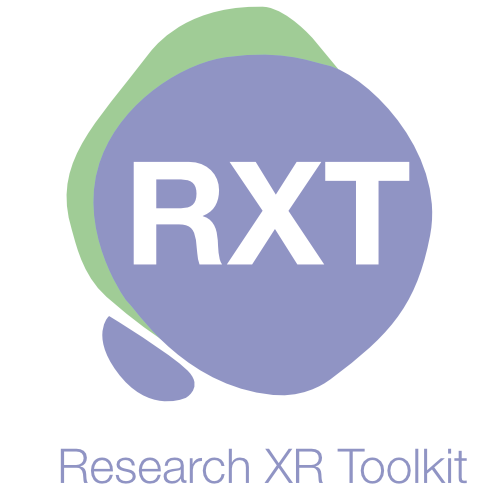

# RXT (Research XR Toolkit)

---

## 📖 Overview

**A template designed around making development of VR applications for research faster and more reliable.  

Building on the VR research infrastructure established through 2 previous project and - **Justin Kasowski** – SimpleOmnia framework development, this template introduces a variaty of QOL updates that accelerate VR development

---

## 📧 Contact

- **Lead Developer:** [jbacho22@bw.edu](mailto:jbacho22@bw.edu)
- **Lab Inquiries:** [Dr. Brian Thomas](mailto:bthomas@bw.edu)
- **Issues & Contributions:** Use the GitHub Issues tab

---

## 🔗 Related Repositories

- **CSV Data Processor**: [VIBES-Lab-Project2-CSV-Processor](https://github.com/JohnBacho/Vibes-Lab-Project2-CSV-Processor)
- **Project 1 (Foundation)**: [Link to Project 1 repository](https://github.com/JohnBacho/VIBES-Lab-Project1)

---

**Made with ❤️ by the VIBES Lab Team**

